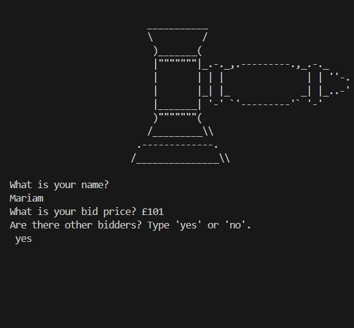
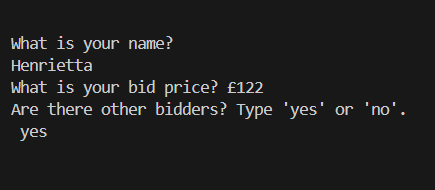
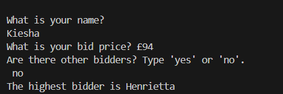

# Silent-Auction
A simple silent auction program in python!

## Summary of program

The program I built can be used between a group of people who want to have a silent auction. It takes a person's name and their bid and adds it to a dictionary. It then asks the user if there is another person who is present to make a bid, if the answer is yes, then the page is "cleared" of the previous user's name and bid and the same prompts are given to the next user until the final bidder answers "no", to break the while loop.

The code then goes through the dictionary to find the highest bidder and prints a statement to show the users!

## Below is an example of the working code

